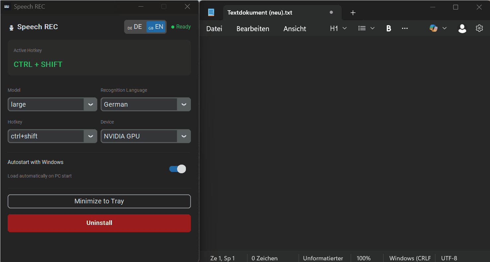
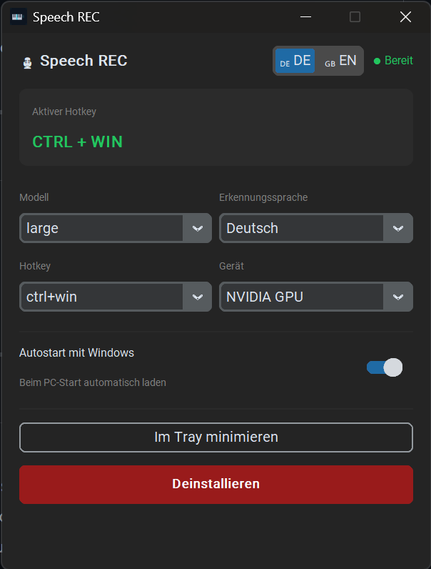

# SpeechREC 🎙️

> **Free offline speech-to-text for Windows — powered by OpenAI Whisper, runs 100% on your PC.**

**SpeechREC** is a free **offline voice-to-text dictation tool for Windows**. Press a hotkey, speak, and your words are typed into any application — browser, Word, Notepad, Discord, anywhere. No subscription, no account, no cloud. Your voice never leaves your PC.

*Press the hotkey, speak, done — works in any app.*

---

## 🚀 Download

👉 **[Download latest version (Windows)](../../releases/latest)**

1. Download `SpeechREC_Setup.exe`
2. Run the installer — app starts automatically
3. Press your hotkey and start dictating

---

## ✨ Features

- 🔒 **100% offline & private** — your voice never leaves your PC, no cloud, no API keys
- ⚡ **NVIDIA GPU support** — fast transcription with CUDA (auto-installed on first launch)
- 🖥️ **CPU mode** — works on any Windows PC, even without a dedicated GPU
- 🌍 **Multilingual** — German, English, French, Spanish, Italian, Portuguese, Russian, Japanese, Chinese, Dutch, Polish, Turkish
- ⌨️ **Works everywhere** — types directly into any text field in any app
- 🎯 **Customizable hotkey** — Ctrl+Win, F9, Caps Lock, mouse buttons, and more
- 🔄 **Autostart** — launches silently on Windows startup, stays in the system tray
- 💸 **Free forever** — no subscription, no ads, no account required
- 🔧 **Auto-save settings** — every change is saved instantly

---

## 💡 Why SpeechREC?

| | SpeechREC | Windows Voice Typing | Dragon NaturallySpeaking | Google Voice Typing |
|---|---|---|---|---|
| Runs offline | ✅ | ⚠️ (partial) | ✅ | ❌ |
| Free forever | ✅ | ✅ | ❌ (~$200+) | ✅ |
| GPU acceleration | ✅ | ❌ | ❌ | — |
| Works in any app | ✅ | ⚠️ | ✅ | ⚠️ |
| No account required | ✅ | ✅ | ❌ | ❌ |
| Uses OpenAI Whisper | ✅ | ❌ | ❌ | ❌ |

---

## 📋 Requirements

- **Windows 10 or 11**
- **8 GB RAM** recommended (4 GB minimum)
- **NVIDIA GPU** recommended for fast transcription (optional — CPU mode works too)
- **Internet connection** for first-time setup only (to download the Whisper model, ~1.5 GB)

---

## 📸 Screenshots

| Settings Window | System Tray |
|:---:|:---:|
|  |  |

---

## 🎯 How it works

1. **Press your hotkey** (default: `Ctrl + Win`)
2. **Speak** — the microphone icon turns red while recording
3. **Release the hotkey** — AI transcribes your speech
4. **Text is typed** into the active window

Everything happens **locally on your PC** using [OpenAI's Whisper](https://github.com/openai/whisper) model — the same state-of-the-art speech recognition that powers ChatGPT Voice.

---

## ❓ FAQ

**Q: Is this really free?**  
Yes. No trial, no subscription, no account. Forever.

**Q: Does it work without internet?**  
Yes, once the Whisper model is downloaded on first launch (~1.5 GB, one-time).

**Q: Is my voice sent anywhere?**  
No. Everything runs locally on your PC. No telemetry, no cloud.

**Q: My friend has an NVIDIA GPU but no Python installed. Will GPU work?**  
Yes! SpeechREC v1.1+ automatically downloads the required CUDA libraries on first launch.

**Q: Does it support my language?**  
12 languages out of the box: DE, EN, FR, ES, IT, PT, RU, JA, ZH, NL, PL, TR. Plus auto-detect.

**Q: Can I change the hotkey?**  
Yes — 9 presets available (Ctrl+Win, Shift+Win, Ctrl+Alt, F8, F9, Caps Lock, Mouse4, Mouse5).

---

## 📝 Changelog

### v1.3.0 — Faster CPU transcription
- ⚡ **6× faster on CPU** — automatically uses Distil-Whisper when model is set to "large" and device is "cpu"
- 🎯 Same quality (<1% accuracy loss vs. standard Whisper Large)
- 💾 49% smaller model — less RAM usage
- 🌐 Multilingual (German, English, and more)

### v1.2.0 — More hotkeys & stability
- ⌨️ **F1–F12 hotkeys** added (previously only F8 and F9)
- 🔄 **Auto-update check** — notifies you monthly if a new version is available
- 🛡️ Dropdown menus are now read-only — prevents accidental invalid values
- 🔒 Automatic config sanitizer — broken config files are repaired on launch
- 🐛 Fixed GPU memory leak caused by invalid dropdown entries

### v1.1.0 — Quality of Life
- 🚀 **Automatic CUDA setup** — missing GPU libraries are downloaded on first launch
- ⚡ **Auto-save** — settings are saved instantly, no more save button
- 🧹 Removed unnecessary notifications toggle
- ✅ Installer starts the app automatically after installation

### v1.0.0 — Initial Release
- Offline speech recognition powered by OpenAI Whisper
- NVIDIA GPU support (auto-detected), CPU fallback included
- System tray with hotkey activation
- Autostart with Windows
- Supports 10+ languages
- No subscription, no account, completely free

---

## 🔖 Keywords

*speech recognition, voice to text, dictation, Whisper AI, offline speech-to-text, Windows dictation tool, voice typing, OpenAI Whisper, free dictation software, speech-to-text Windows, Spracherkennung, Diktiersoftware, offline Diktat, kostenlose Spracherkennung*

---

## ☕ Support

If you find SpeechREC useful, consider buying me a coffee — it helps me keep the project free.

